# 📈 Stock Price Prediction using ML

A modern, interactive Flask web app to forecast **next day's stock closing price** using machine learning. Built with a stunning, recruiter-friendly dashboard UI, clean code, and rich charts.

## ✨ Screenshots

### Login Page
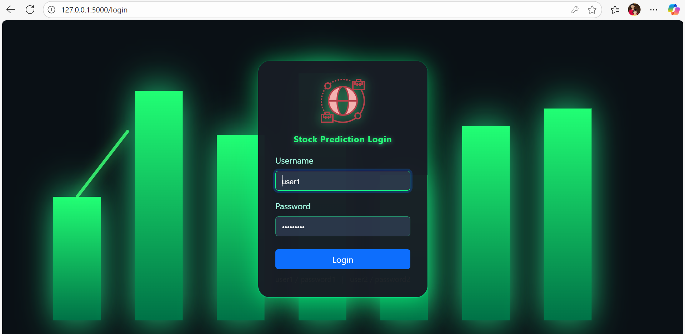

### Homepage
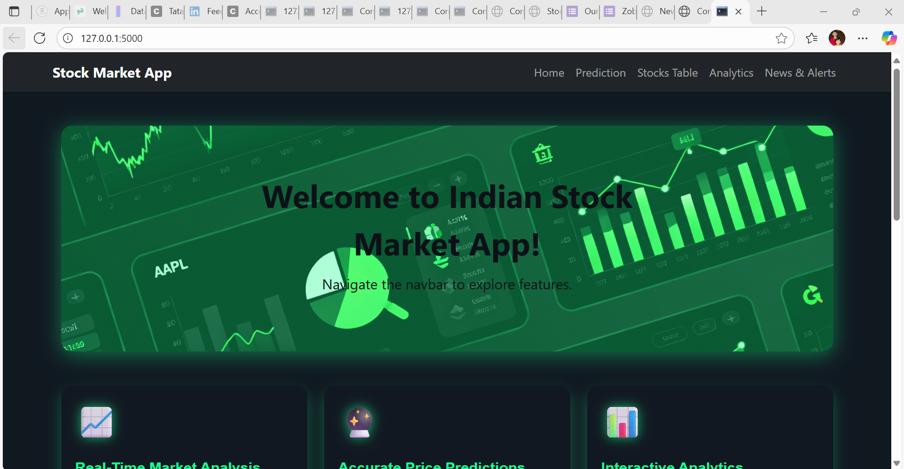
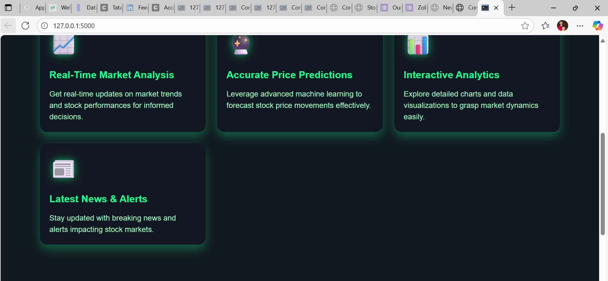

### News Alerts
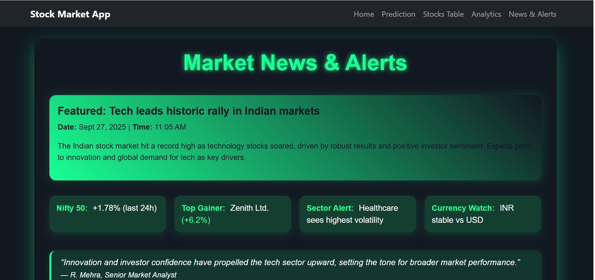
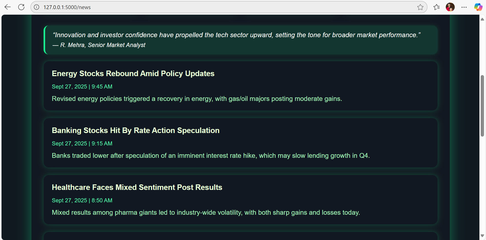
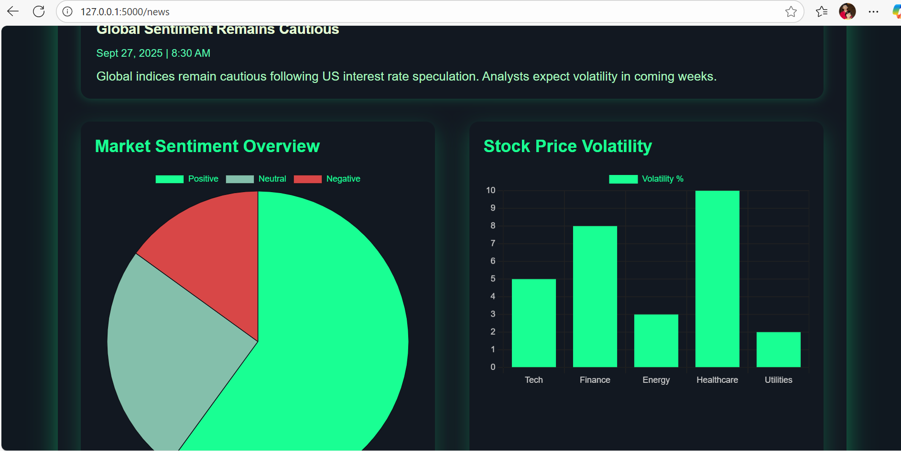

### Prediction Workflow
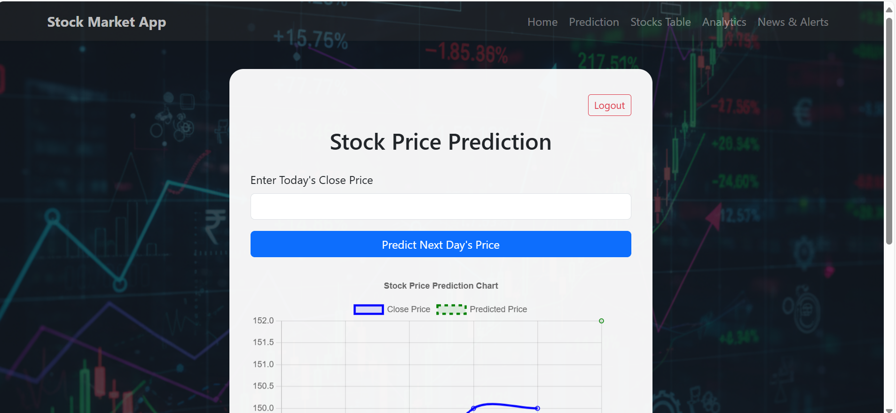
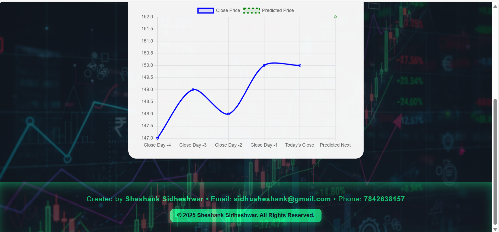

### Analytics & Chart
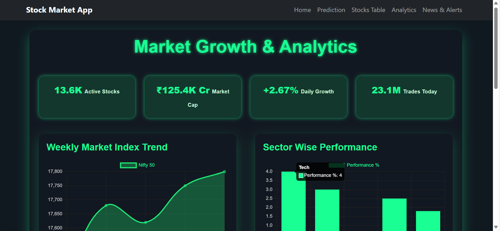
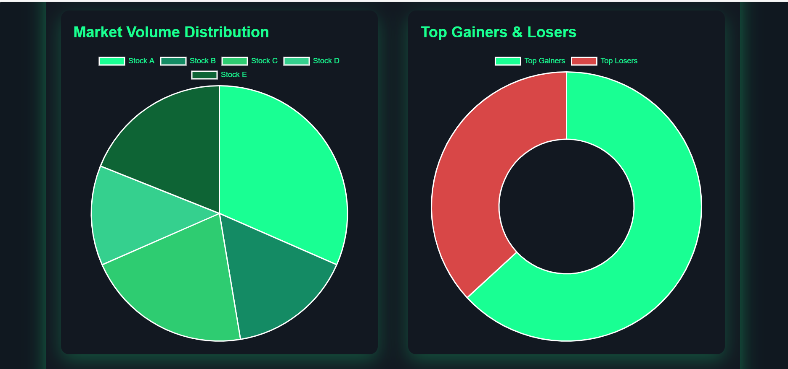
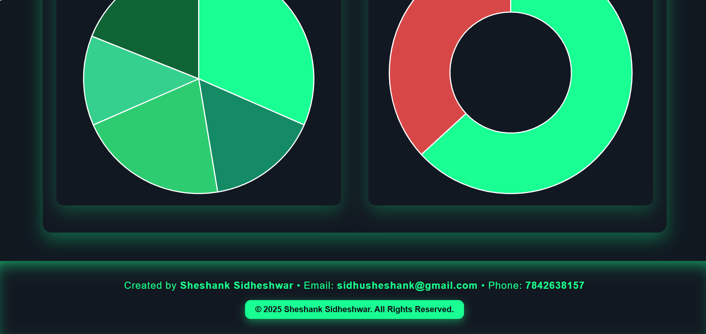

### 🗃️ Stocks Table
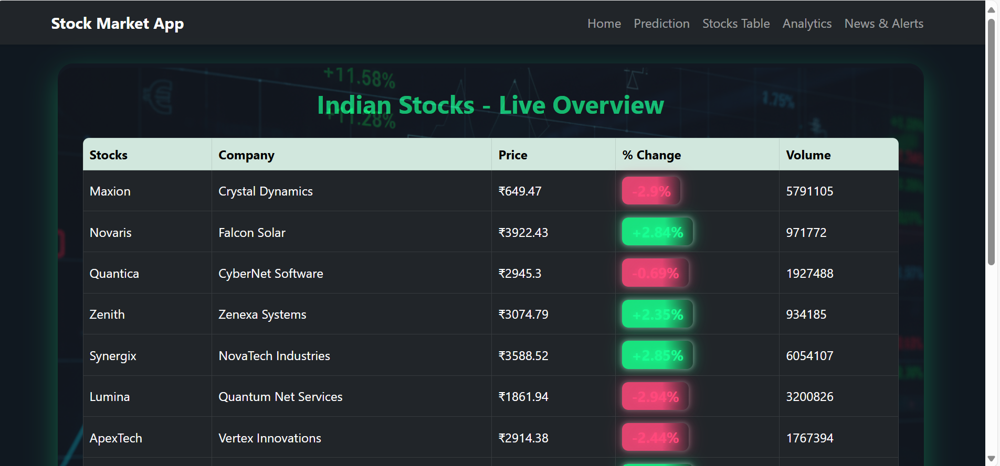

---

## 🏗️ Project Structure

stock_prediction_using_ml/
├── ml/
│ ├── preprocess.py
│ ├── train.py
│ ├── utils.py
│ └── model.pkl
├── screenshots/
│ └── [All referenced image files]
├── tests/
│ └── test_app.py
├── config.py
├── requirements.txt
├── README.md
└── [Flask app files: templates, static, etc.]

---

## ⚡ Quickstart

1. **Clone the repository:**
git clone https://github.com/sidhushesank/stock_prediction_using_ml.git
cd stock_prediction_using_ml

2. **Create and activate a virtual environment:**
python -m venv venv
source venv/bin/activate

3. **Install dependencies:**
   pip install -r requirements.txt

4. **Run the app:**
python run.py
Open [http://127.0.0.1:5000](http://127.0.0.1:5000/) in your browser.

---

## 🧠 How It Works

- Users securely log in and enter today's closing price.
- The app loads a regression ML model to predict the next day's closing price.
- Predictions and analytics update dynamically including news and charts panels.

---

## 📊 Model Details

- Regression model trained in `ml/train.py`.
- Inputs: recent closing prices entered by the user.
- Output: next day's predicted close price.

Retrain the model anytime:
python ml/train.py
---

## 🛡️ Testing

Run all automated tests:
pytest tests/
---

## 💻 Tech Stack

- Python 3.8+, Flask web framework
- Pandas, scikit-learn (ML libraries)
- Chart.js, Bootstrap, HTML/CSS for frontend
- VS Code for development

---

## 📩 Contact & Contribute

Developed by [Sheshank Sidheshwar](https://github.com/sidhushesank).  
Feel free to open an issue or submit a pull request for improvements!

---

## 📜 License

MIT License

---

